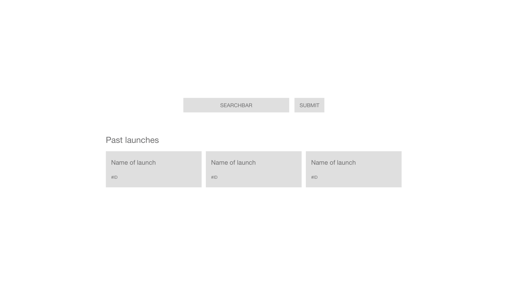
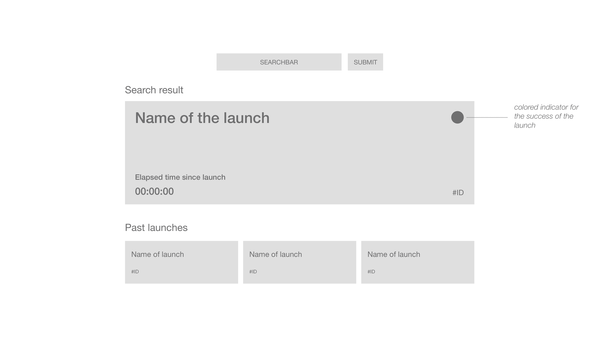
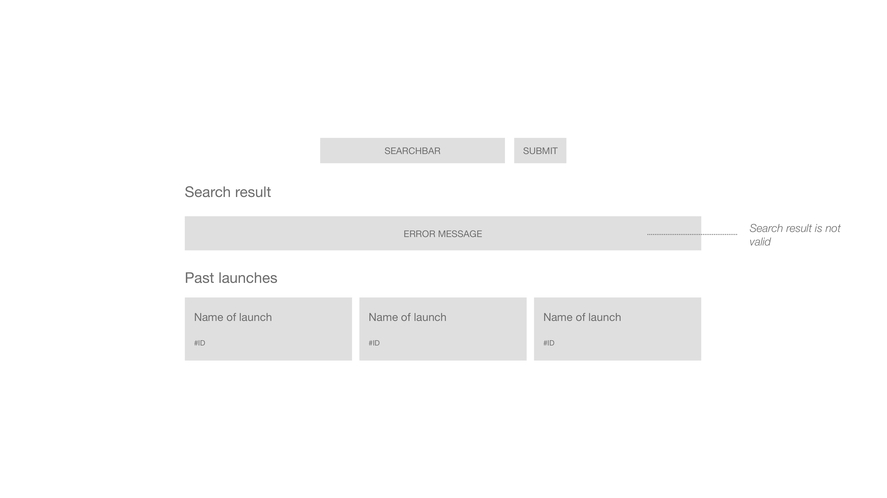

# BITGRIP Job Application Project

Hey Berk 😊

thank you for your application for the position as a frontend developer at BITGRIP.
The frontend team builds modern, performant and accessible websites and web applications with the JavaScript library [React](https://reactjs.org/).

**We want you to implement a small project, which shouldn't keep you busy for more than two hours: Create a web application, which informs about past SpaceX launches.**

> This project will use the open [SpaceX-API](https://github.com/r-spacex/SpaceX-API/blob/master/docs/v4/README.md). All used endpoints are `GET` requests without authentication.

- The desktop layout of the application is based on the mockups in the `/mockups`. (Hint: The whole application is centered on the screen.)
  - *Find also a proper responsive behaviour for the mobile layout by yourself.*
- On the initial start of the application the past three SpaceX launches are shown in a sorted order.
  - *[See endpoint documentation](https://github.com/r-spacex/SpaceX-API/blob/master/docs/v4/launches/past.md)*
  - 
- There is a search (consists of text input and submit button) for requesting a launch by its ID.
  - *[See endpoint documentation](https://github.com/r-spacex/SpaceX-API/blob/master/docs/v4/launches/one.md)*
  - *The page doesn't reload when submitting the form.*
- A valid request for a launch ID results in a detailed view of this launch.
  - The elapsed time since the launch is a live counter in the format hh:mm:ss.
  - 
- An invalid request for a launch ID results in a simple error message on the screen.
  - 

If you have any questions regarding this project, please don't hesitate to contact us.

Happy Coding and Keep Turning Bits Into Smiles 🙌

----

### Table of contents
- [Project](#project)
- [Getting started](#getting-started)
- [Developing](#developing)
- [Finishing](#finishing)

### Getting started 🚀

This project is bootstrapped with [Create React App](https://create-react-app.dev/), so you have a ready-for-coding boilerplate.

Make sure to install the project dependencies with `npm install`.

Start the project application with `npm start` and visit [http://localhost:3000](http://localhost:3000) in your browser.

### Developing 💻

This boilerplate gives you access to CSS, CSS modules, JavaScript (ES6+) and React out of the box.
You can add any additional dependency.

Please put all your code inside the `/src` folder, to make the review easier for us.

Please don't touch any files in the root folder nor the `/public` folder.

### Finishing 🏁

You don't need to host this project anywhere, we keep it simple:

1. Remove the `/node_modules` folder and the `/package-lock.json` file.
2. Compress the project directory into a `.zip` file.
3. Send the compressed project directory back to us.
